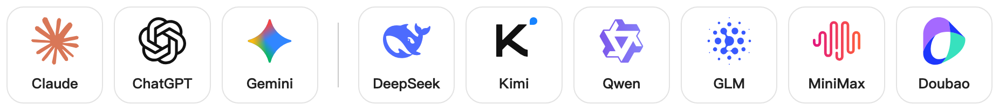
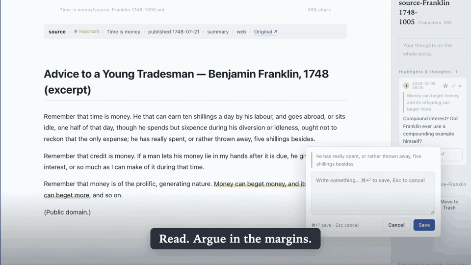
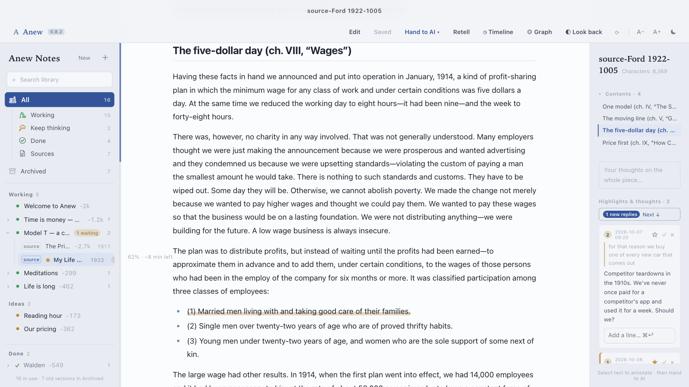
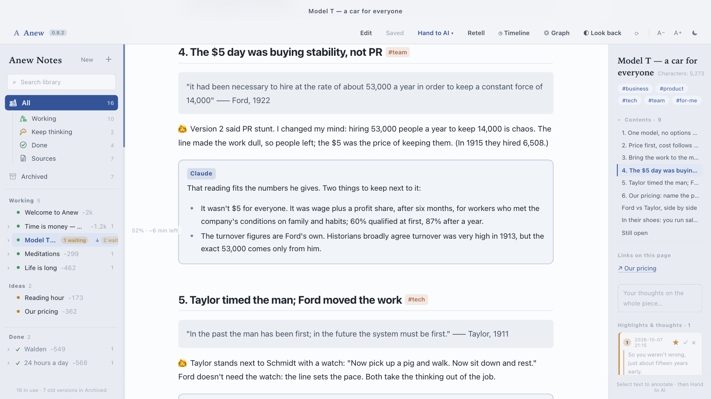
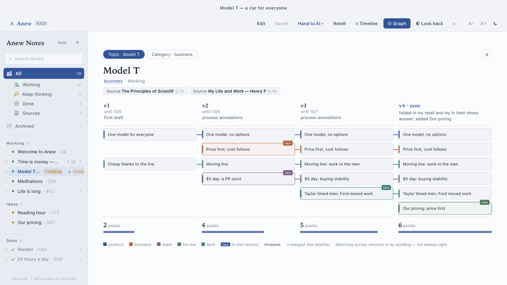
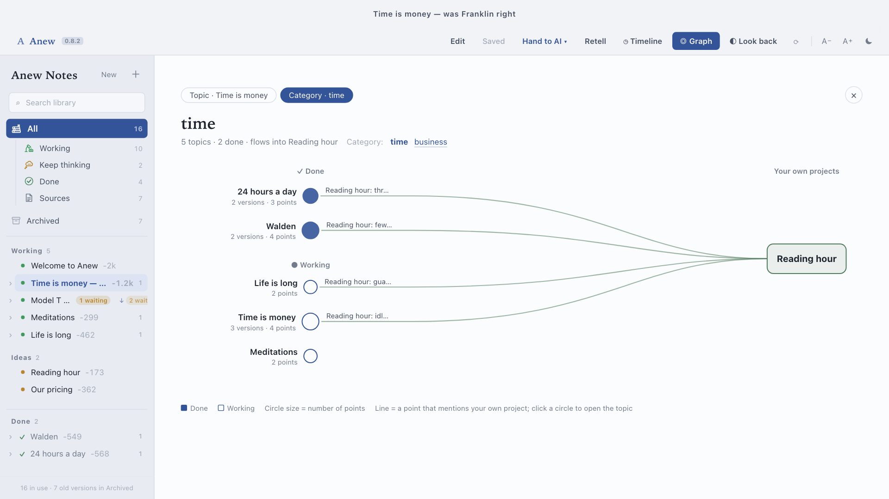
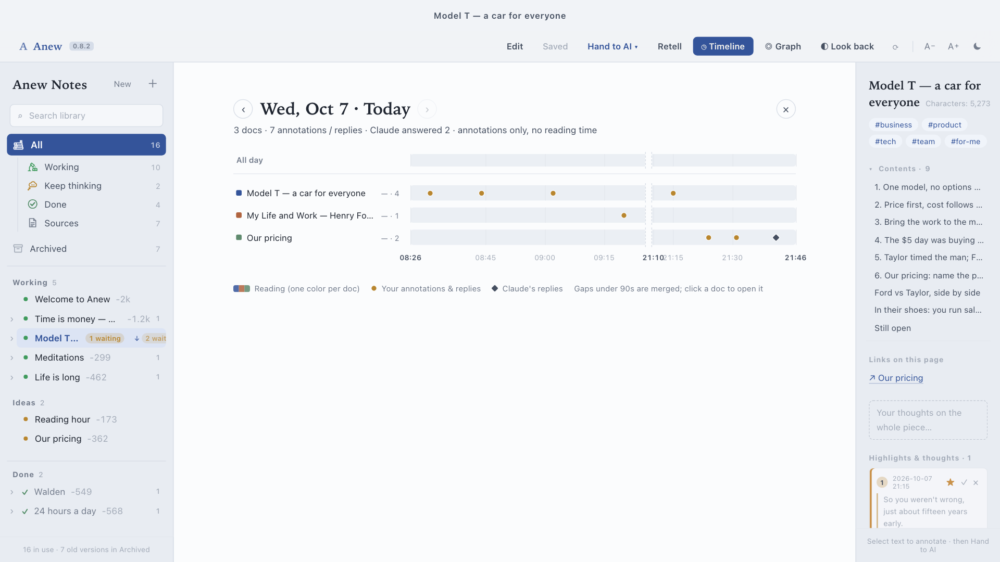

<div align="center">



# Anew 知新

### Read with AI in the margins.

**You highlight and argue with the text. The AI fact-checks you and rewrites your notes, right in the files.**
**No chat log to scroll back through. Just a note that gets better every time you read.**

macOS · any AI agent that can edit files (Claude Code by default; [DeepSeek, Kimi, Qwen… work too](#use-any-ai)) · plain Markdown · MIT

[中文说明](README.zh-CN.md)



<!-- TODO: full 48s video — drag media/out/anew-promo-small.mp4 into this README on github.com to get a playable link, then paste it here -->

</div>

---

## A chat ends. A note grows.

You've probably done this: paste an article into a chatbot, ask good questions, get good answers… and a week later all you have is a long chat you'll never scroll through again.

Anew works the other way around. You read the way you always have: pen in hand, scribbling in the margins. When you're done, one click hands your margin notes to the AI. It doesn't reply in a chat. It **edits your note**:

```markdown
## 4. The $5 day was buying stability, not PR

> "it had been necessary to hire at the rate of about 53,000 a year
> in order to keep a constant force of 14,000" —— Ford, 1922

👩 Version 2 said PR stunt. I changed my mind: hiring 53,000 people a year
to keep 14,000 is chaos. The $5 was the price of keeping them.

> [!claude]
> That reading fits the numbers he gives. But it wasn't $5 for everyone:
> it was wage plus a profit share, after six months, for workers who met
> the company's conditions. And the 53,000 comes only from Ford himself.
```

👩 is you, in your own words, never rewritten. `[!claude]` is the AI (the name is just the file format, whichever model you use): checking your facts, adding what you missed, pushing back when you're wrong (and saying so when you're right). Read more, annotate again, and the note gets another version. You can watch your own thinking change.

I built it to read long interviews and company materials. In the first week I wrote around 500 study notes with it, and all of them are still in my notes, none lost in a chat.

## The whole loop, with a real example

The example library that ships with the app contains a small research report: **"Model T: how did Ford make a car everyone could buy?"** It was written over three days from two public-domain books, Henry Ford's *My Life and Work* (1922) and Frederick Taylor's *The Principles of Scientific Management* (1911). Here is how it got made, step by step. You can open every file mentioned below.

### 1. Collect the sources

A topic is a folder. Sources go into it as Markdown files, three ways:

- **Ask the AI:** "Find sources on the Model T and the $5 day." It searches, saves the important ones in full (others as summaries), fills in the publication date, and tells you which to read first.
- **Clip from the web:** with the Chrome extension, highlight a sentence on any page. The page is saved into your library as a source (full text via Readability), and your highlights come along as annotations.
- **Paste a link in the app:** **＋ → Save a source**. Anew copies a one-line prompt; your AI agent fetches the page and fills the file.

In the example, the Model T folder has two sources: Ford's chapters on the one-model decision, the moving line, wages and pricing, and Taylor's pig-iron chapter.

### 2. Read and annotate

Select a sentence, click **＋ Annotate**, write what you think: a question, a doubt, a sum, half a sentence. Rough is fine; you're writing to yourself.



Ford's source has 11 annotations. Some are questions (*"Who checked whether you 'take good care' of your family?"*), some are maths (*"price −62%, output ×42"*), some are just reactions. Click ☆ on the ones you want to keep thinking about. Done reading? Hit **Retell** 🎙 and explain the whole thing out loud; that goes in as one long annotation.

### 3. Hand it to the AI

**Hand to AI ▾** (top right) → **Process annotations**. Anew copies one line, like `Process annotations: …/Model T/source-Ford 1922-1005.md (2 waiting)`. Paste it into your AI agent: Claude Code, or Claude Code running DeepSeek, or Codex, Gemini CLI… (see [Use any AI](#use-any-ai)).

That's the only handoff. The app never calls a model, and the AI never talks to the app: they meet in the files.

### 4. The AI rewrites the note

The AI reads every open annotation and **improves the note's body** instead of replying in a chat:

- your own words go under 👩, unchanged;
- its fact-checks, additions and disagreements go in `> [!claude]` cards;
- the previous version is kept as `old-…md`;
- each annotation is marked handled, with where it went (*"Improved the note: section 4"*);
- the note's properties record the version, its main points, and one line on what changed.

Anew notices the change within 1.5 seconds and shows you what moved. A badge in the sidebar tells you which notes have new edits or replies.



The `anew` skill tells the AI to check, not to agree. In the example it catches that Ford's famous *"any colour… so long as it is black"* is dated 1909 in his book, but black-only is usually dated to about 1914–1925; and it warns that Taylor's pig-iron story is Taylor's own retelling. It never writes your opinions for you, and never invents a quote or a date.

### 5. Go around again

Each round of reading and annotating makes a new version. You can also annotate the AI's cards (*"Good catch. Keep this."*) and ask for more:

- **Put me in their shoes:** the AI gives you only what people knew at the time (*"It's 1909, you run sales at Ford. Do you back one model, or argue for a range?"*), waits for your answer, then tells you what happened.
- **Compare:** a side-by-side table (Taylor 1911 vs Ford 1922: what changed, what didn't), one line per row, for you to annotate.
- **Collect web annotations / Rebuild:** after a pile of further reading, fold it in and rebuild the note around what you now think.

The Model T report went: **v1** "it was the assembly line" → **v2** "price came first; the $5 day was a PR stunt" → **v3** "the $5 day was buying stability" (after seeing the 53,000 figure) + Taylor → **v4** retold out loud, plus what it means for the reader's own pricing.

### 6. See how your thinking changed

**◎ Graph → Topic** draws every version as a column and every point as a line: which ones appeared, which were dropped, which merged.



**◎ Graph → Category** shows a whole category of reading (say, everything tagged *time*) and which points flow into your own projects.



**◷ Timeline** shows a day of reading: which documents you annotated, when, and when the AI answered.



## What it's good for

Anew is for reading where **the point is a conclusion you can defend**, built up over several sittings.

- **Research reports.** A question, a handful of primary sources, a note that has to hold up. Company and product research, a market or a technology, a historical case like the Model T. Every claim in the note sits next to its quote; the AI says when something rests on a single source or couldn't be verified; open questions stay in the note instead of getting lost.
- **Studying a company or a founder.** Long interviews, letters to shareholders, old pitch decks, read in date order. *In their shoes* is built for this: decide with what they knew, then see what happened.
- **Literature reviews and learning a field.** Several papers per topic, a comparison table, a note per topic that keeps improving as you read more.
- **Books you want to keep.** One note per book that grows with every rereading, instead of highlights you never open again.
- **Decisions of your own.** Mark a note as *keep-thinking* (like *Our pricing* in the example), and the graph shows which of your reading feeds into it.

It's probably **not** for quick lookups (just ask an AI), live team editing, or reading on your phone.

**Who tends to like it:** you read to think, not to collect; you already use an AI and wish its best answers didn't vanish into chat history; you like your files on your own disk, as Markdown you can open in Obsidian, grep, or put in git.

## Things you can say to the AI

Anew copies the prompt for you. You can also just type it into your AI agent.

| Say | What happens |
| --- | --- |
| **Process annotations** | Your margin notes get folded into the note. Your words stay yours; the AI's additions and pushback go in cards. The old version is kept. |
| **Retell** 🎙 | Hit the mic and explain the whole piece out loud, rambling welcome. The AI turns it into a structured note. |
| **Put me in their shoes** | The AI gives you only what *they* knew back then (say, 1909) and asks: *would you invest? build it? which one?* It won't tell you what happened until you've answered. |
| **Compare** | A side-by-side table, A / B / what changed / what didn't, one line per row, for you to annotate. |
| **Rebuild** | After a pile of further reading, the AI rebuilds the note around what *you* now think. |
| **Look back** ◐ | Starting from what you read in the last three days, the AI digs up older things in your library: two related, one that argues against you, one at random. |
| **Find sources on…** | The AI goes looking, saves the important ones in full, and tells you what to read first. |

## Use any AI

The button says **Hand to AI**, not "hand to Claude". Anew only writes files and copies a one-line prompt, so any AI agent that can read and write files on your Mac can do the other half. Claude Code is the default and the most tested; it also runs other companies' models.

**Example: DeepSeek.** DeepSeek offers an Anthropic-compatible API, so Claude Code can run on DeepSeek's model ([DeepSeek's guide](https://api-docs.deepseek.com/guides/coding_agents)):

```bash
export ANTHROPIC_BASE_URL=https://api.deepseek.com/anthropic
export ANTHROPIC_AUTH_TOKEN=<your DeepSeek API key>
export ANTHROPIC_MODEL=deepseek-flash
claude
```

Install the skill as below, click **Hand to AI ▾**, paste. Same loop, same files, DeepSeek doing the reading.

**Other models.** Kimi, Qwen, GLM, MiniMax, Doubao and others can be used the same way if your provider offers an Anthropic-compatible endpoint (check its docs for the URL and model name). Or use a provider's own agent, such as OpenAI's Codex CLI, Google's Gemini CLI or Qwen Code: put the rules from [`skill/anew/SKILL.md`](skill/anew/SKILL.md) in its instructions file (`AGENTS.md` for Codex, `GEMINI.md` for Gemini CLI), or start with "Read skill/anew/SKILL.md and follow it for my Anew library."

How well it goes depends on the model: the rules ask it to fact-check you, keep your words untouched and never invent quotes, and stronger models follow them better.

## Why it's built this way

- **The app never calls a model.** No API key in the app, no server, no account. Use whichever AI you already pay for.
- **The AI never talks to the app.** They meet in the files: the AI edits them, Anew notices within 1.5 seconds and refreshes.
- **Your words are sacred.** The skill tells the AI never to write "my thoughts" for you, never to invent a quote or a date, and to say so when it couldn't verify something.
- **Nothing is lost.** Every rewrite keeps the old version, and the app keeps an edit history.

## What's in the box

| | |
| --- | --- |
| **Mac app** (`native/`) | Swift + WKWebView, ~7k lines, zero dependencies. Library sidebar by topic; read / edit / annotate; auto-save; version history; graph and timeline. |
| **Chrome extension** (`chrome/`) | Highlight on any page → saved as a source (summary or full text via Readability), highlights become annotations. Native messaging writes straight into your library. |
| **AI skill** (`skill/anew/`) | Teaches the AI the file layout, the annotation format, and every prompt above, in English or Chinese. |
| **Example library** (`example-library/en`, `zh`) | Copied to `~/Documents/Anew Notes` on first launch, in your system language: the Model T research report (2 sources, 4 versions, 19 annotations), five short classics on time, and two "own projects" the reading feeds into. |

## Install

You'll need macOS 13 or later (Apple silicon or Intel) and an AI agent that can read and write files: [Claude Code](https://claude.com/claude-code) by default, with any model (see [Use any AI](#use-any-ai)).

**1. Download the app.** Get **[Anew-0.8.2.dmg](https://github.com/daisycao/anew/releases/latest)** from Releases, open it, and drag **Anew** into Applications.

The app isn't signed with an Apple developer certificate yet, so the first time macOS will say it can't verify the developer. Click **Done**, then go to **System Settings → Privacy & Security**, scroll down and click **Open Anyway**. You only do this once. (Or run `xattr -dr com.apple.quarantine "/Applications/知新 Anew.app"` in Terminal.)

**2. Teach your AI how to work with your library** (for Claude Code; for other agents see [Use any AI](#use-any-ai)):

```bash
mkdir -p ~/.claude/skills/anew && curl -fsSL https://raw.githubusercontent.com/daisycao/anew/main/skill/anew/SKILL.md -o ~/.claude/skills/anew/SKILL.md
```

**Build from source instead** (needs Xcode Command Line Tools, `xcode-select --install`):

```bash
git clone https://github.com/daisycao/anew.git
cd anew
zsh native/build-app.sh
open "outputs/知新 Anew.app"
```

**Optional, the Chrome extension** (needs the cloned repo and Node.js):

1. Double-click `chrome/install-extension.command` (registers the native host that writes into your library).
2. Open `chrome://extensions`, turn on **Developer mode**, click **Load unpacked**, pick the `chrome/` folder.

## Try it in two minutes

1. Open Anew. The example library is already there. Start with **Welcome**, then **Model T**.
2. Open the source **Ford 1922**, select a sentence → **＋ Annotate** → write what you think, even one line.
3. **Hand to AI ▾** (top right) → **Process annotations** → paste into your AI agent.
4. Watch the report turn into version 5. Your line is under 👩; the AI's answer is in a card next to it. Open **◎ Graph** to see the new column.

Then point it at your own reading: **File → Open Library…** (⇧⌘O) opens any folder of Markdown. An Obsidian vault works.

## How it works

```
Anew Notes/
  Model T/
    source-Ford 1922-1005.md            ← a source (read-only in the app)
    source-Taylor 1911-1006.md
    Model T — a car for everyone.md     ← your note, rewritten with the AI (v4)
    old-retell-1007.md                  ← v3, kept when the AI rewrote it
    old-process annotations-1006.md     ← v2
    old-process annotations-1005.md     ← v1
  Our pricing/Our pricing.md            ← your own project (type: keep-thinking)
  .paper-md-notes/<base64 path>.json    ← annotations + reply threads
  .paper-md-history/…                   ← edit history
~/.anew/library                         ← which folder is your library (shared by app, extension, skill)
```

Notes carry Obsidian-compatible YAML properties (`type`, `stage`, `sources`, `version`, `points`, `changed`…); the graph is drawn from `points` across versions. Annotations live next to the Markdown, never inside it, so your text stays clean. The full format is in [`skill/anew/SKILL.md`](skill/anew/SKILL.md).

## Status

A personal tool, used daily since September 2026, now shared. Honest caveats:

- **Mac only.** Not signed with an Apple developer certificate or notarized yet: the first open needs **Open Anyway** (see [Install](#install)).
- **English and Chinese.** The app, extension and example library follow your system language; the skill writes in your library's language.
- **Timeline reading time** (how long you spent on each document) comes from a separate time tracker of mine and isn't included; without it the timeline shows annotations and replies only.
- Built on an earlier reader of mine, Paper MD, so you'll see `paper-md` in a few file names.

Issues and ideas welcome. Especially: what did you read with it?

## License

MIT. `chrome/lib/` bundles Mozilla Readability (Apache 2.0) and Turndown (MIT). The example library quotes public-domain texts from Project Gutenberg and Wikisource.
