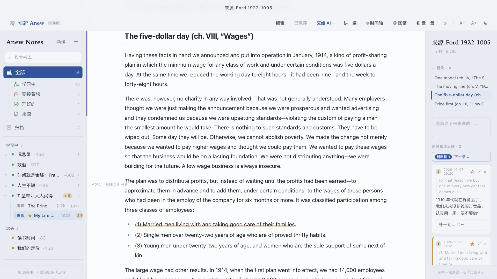
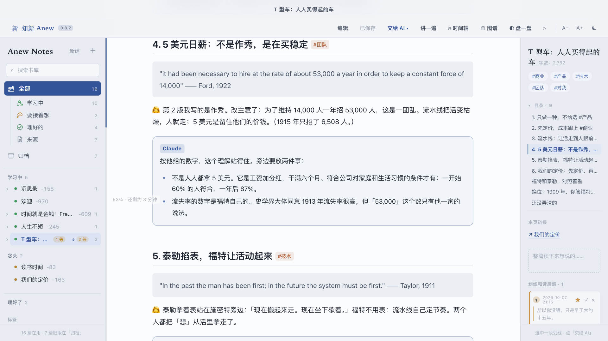
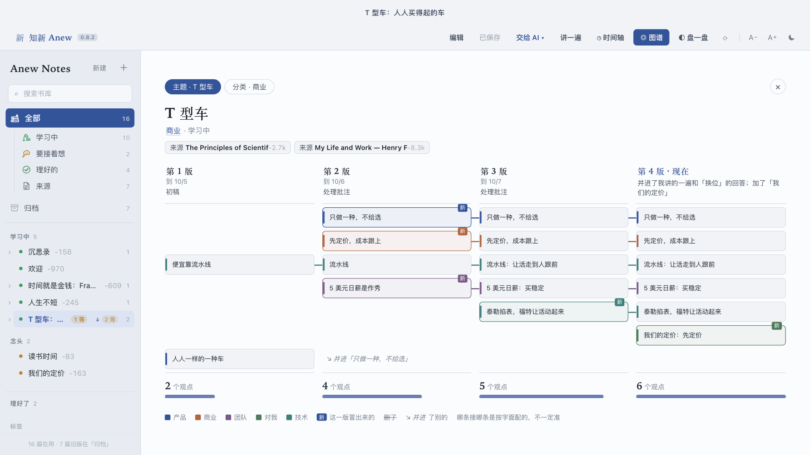
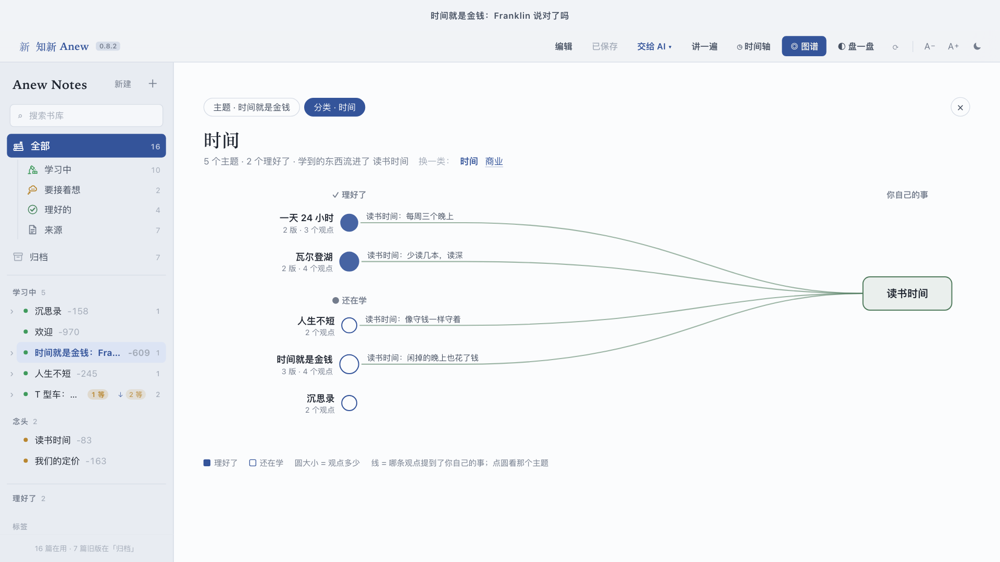
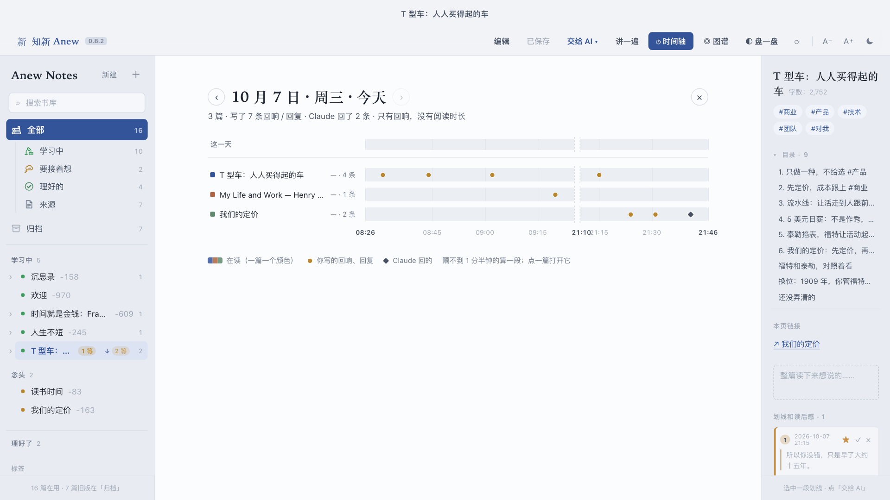

<div align="center">


# 知新 Anew

### 和 AI 一起读，它在页边回你。

**你划线、批注、和原文较劲；AI 帮你查证，把笔记改好，直接改在文件里。**
**不留一长串聊天记录，只留一篇越读越好的笔记。**

macOS · 任何能改文件的 AI 助手（默认 Claude Code；[DeepSeek、Kimi、千问……也行](#哪家-ai-都能用)） · 纯 Markdown · MIT

[English](README.md)

<!-- TODO: 演示 GIF（约 15 秒）：选中一句 → 写个想法 → 交给 AI → 贴进 AI → 笔记自己改好 -->

</div>

---

## 聊天会结束，笔记会长大

你多半这样做过：把一篇文章丢给 AI，问了一堆好问题，也拿到了好回答……一周后，手上只剩一长串再也不会翻回去的对话。

Anew 反过来。你照平常那样读：拿着笔，在页边写想法。读完点一下，把页边的批注交给 AI。它不在对话框里回你，而是**直接改你的笔记**：

```markdown
## 4. 5 美元日薪：不是作秀，是在买稳定

> "it had been necessary to hire at the rate of about 53,000 a year
> in order to keep a constant force of 14,000" —— Ford, 1922

👩 第 2 版我写的是作秀。改主意了：为了维持 14,000 人一年招 53,000 人，
这是一团乱。5 美元是留住他们的价钱。

> [!claude]
> 按他给的数字，这个理解站得住。但不是人人都拿 5 美元：它是工资加分红，
> 干满六个月、符合公司的条件才有。而且「53,000」只有福特一家的说法。
```

👩 是你，原话照留，AI 不替你改。`[!claude]` 是 AI（不管用哪家模型，文件里都这么写）：查你的事实，补你漏的，你错了它反驳，你对了它也会直说。再读、再批注，笔记就多一版。你能看到自己的想法是怎么变的。

我做它是为了读长访谈和公司资料。第一周用它写了大约 500 条学习笔记，全都留在自己的笔记里，没有一条沉在聊天记录里。

## 一整圈怎么走：拿一个真例子说

App 自带的示例库里有一篇小研究报告：**《T 型车：福特是怎么做出一辆人人买得起的车的？》**。它是三天里用两本公版书写出来的：福特的自传《我的生活与工作》（1922）和泰勒的《科学管理原理》（1911）。下面一步一步讲它是怎么来的，提到的每个文件你都能打开看。

### 1. 收来源

一个主题就是一个文件夹，来源是里面的 Markdown 文件。三种进法：

- **让 AI 去找：**「去找来源：T 型车和 5 美元日薪」。AI 自己搜，重要的存全文、其余存摘要，填好原文发表日期，告诉你先读哪几篇。
- **网页上划线：**装了 Chrome 插件，在任何网页上划一句，整页就存进库里当来源（用 Readability 抓全文），你划的句子变成批注。
- **在 App 里贴网址：**「＋ → 存一篇来源」。Anew 复制好一句话，贴进你的 AI，它去把原文抓下来填进文件。

示例里，「T 型车」文件夹有两篇来源：福特讲只做一种车、流水线、工资和定价的几章，和泰勒搬生铁那一章。

### 2. 读、划线、批注

选中一句，点「＋ 划线」，写下你在想什么：一个问题、一点怀疑、一笔账、半句话都行。写给自己看的，不用写得好。



福特那篇有 11 条批注。有的是问题（「谁来检查你有没有『好好照顾家庭』？」），有的是算账（「价格 −62%，产量 ×42」），有的只是一句反应。想接着琢磨的点 ☆。读完了，点「讲一遍」🎙，用嘴把整件事讲一遍，它会作为一条长批注存下来。

### 3. 交给 AI

右上角「交给 AI ▾」→「处理这篇的回响」。Anew 复制好一句话，比如 `处理下批注：…/T 型车/来源-Ford 1922-1005.md（2 条等你回）`，贴进你的 AI：Claude Code，或者接了 DeepSeek 的 Claude Code，或者 Codex、Gemini CLI……（见[哪家 AI 都能用](#哪家-ai-都能用)）。

只交接这一下。App 从不调模型，AI 也不跟 App 通信：它们在文件里碰头。

### 4. AI 改笔记

AI 读完所有没处理的批注，**改的是笔记正文**，不是在对话框里回你：

- 你自己的话放在 👩 下面，一个字不改；
- 它的查证、补充和不同意见放在 `> [!claude]` 卡片里；
- 上一版留成「旧版-…md」；
- 每条批注标成已处理，写明去了哪（「已改进正文：第 4 块」）；
- 笔记属性里记下版本号、这一版的几个观点、一句话说改了什么。

Anew 1.5 秒内发现改动，标出哪里变了。左边栏的小标告诉你哪几篇有新改动、新回复。



`anew` skill 要求 AI 去核对，而不是附和。示例里它指出：福特那句「任何颜色都行，只要是黑色」在书里说是 1909 年，但「只有黑色」通常认为是约 1914–1925 年的事；它也提醒，泰勒搬生铁的故事是泰勒自己转述的。它从不替你写「我的想法」，也不编引文和日期。

### 5. 再来一圈

每读一轮、批注一轮，就多一版。你也可以在 AI 的卡片上批注（「抓得好，留着」），还可以让它：

- **换位：**只给你当时的人能知道的信息（「1909 年，你管福特的销售。支持只做一种车，还是主张做一个车型系列？」），等你答了，再告诉你后来怎样了。
- **对照：**一张对照表（泰勒 1911 vs 福特 1922：变了什么、没变什么），一行一句，留给你批注。
- **收一下网页批注 / 重整一遍：**补充读了一堆以后，收进来，再按你现在的看法把笔记重搭一遍。

T 型车这篇是这样走的：**第 1 版**「靠流水线」→ **第 2 版**「价格在前；5 美元日薪是作秀」→ **第 3 版**看到 53,000 这个数，改成「5 美元日薪是在买稳定」，加了泰勒 → **第 4 版**用嘴讲了一遍，又想到对自己定价的启发。

### 6. 看自己的想法怎么变的

「◎ 图谱 → 主题」把每一版画成一列、每个观点画成一行：哪些是新冒出来的、哪些删了、哪些并进了别的。



「◎ 图谱 → 分类」看一整类阅读（比如所有打了「时间」标签的），以及哪些观点流进了你自己的事。



「◷ 时间轴」看某一天：批注了哪几篇、几点写的、AI 几点回的。



## 适合做什么

Anew 适合那种**要读出一个站得住的结论、而且要分好几次读完**的事。

- **研究报告。** 一个问题，几篇一手来源，一篇要经得起追问的笔记。公司和产品研究、一个市场或一项技术、一个像 T 型车这样的历史案例。笔记里每个判断旁边都有原文；只靠一个来源、或者核实不了的，AI 会直说；没弄清的问题留在笔记里，不会丢。
- **研究一家公司、一个创始人。** 长访谈、致股东信、老 BP，按时间顺着读。「换位」就是为这个做的：先用他们当时知道的做决定，再看后来怎样。
- **文献综述、入门一个领域。** 一个主题几篇论文，一张对照表，一篇随着越读越多不断改进的笔记。
- **想留下来的书。** 一本书一篇笔记，每重读一次就长一点，而不是一堆再也不会打开的划线。
- **自己要做的决定。** 把一篇笔记标成「要接着想」（像示例里的「我们的定价」），图谱会画出你读的哪些东西流到了它。

大概**不适合**：查个事实（直接问 AI 就行）、多人实时协作、在手机上读。

**谁会喜欢：**读东西是为了想清楚，不是为了收藏；已经在用 AI，又可惜它最好的回答都沉在聊天记录里；喜欢文件在自己硬盘上，是 Markdown，Obsidian 能开，能搜，能放进 git。

## 你可以对 AI 说

Anew 会帮你把这句话复制好；你也可以直接在你的 AI 里打。

| 说 | 会发生什么 |
| --- | --- |
| **处理下批注** | 你的批注并进笔记正文。你的话原样保留，AI 的补充和反驳放在卡片里，旧版自动留底。 |
| **讲一遍** 🎙 | 点话筒，把整篇用自己的话讲一遍，啰嗦也没关系。AI 帮你理成一篇有结构的笔记。 |
| **换位** | AI 只给你当时的人能知道的信息（比如 1909 年），然后问你：投不投？做不做？选哪个？你答了，它才告诉你后来怎样了。 |
| **对照** | 一张对照表：A / B / 变了什么 / 没变什么，一行一句，留给你批注。 |
| **重整一遍** | 补充读了一堆以后，AI 按你现在的看法把笔记的骨架重搭一遍。 |
| **盘一盘** ◐ | 从你最近三天读的东西出发，去库里翻旧材料：两条相关的、一条唱反调的、一条随机的。 |
| **去找来源** | AI 自己去找，重要的存全文，告诉你先读哪几篇。 |

## 哪家 AI 都能用

按钮叫「交给 AI」，不叫「交给 Claude」。Anew 只管写文件、复制一句话，另一半谁来做都行：只要是能在你 Mac 上读写文件的 AI 助手。默认用 Claude Code，测得最多；它也能接别家的模型。

**举个例子：DeepSeek。** DeepSeek 提供兼容 Anthropic 的接口，Claude Code 可以直接跑在 DeepSeek 的模型上（[DeepSeek 官方说明](https://api-docs.deepseek.com/zh-cn/guides/coding_agents)）：

```bash
export ANTHROPIC_BASE_URL=https://api.deepseek.com/anthropic
export ANTHROPIC_AUTH_TOKEN=<你的 DeepSeek API key>
export ANTHROPIC_MODEL=deepseek-flash
claude
```

照下面装好 skill，点「交给 AI ▾」，贴进去。同一套流程、同一批文件，只是换成 DeepSeek 来读。

**其他模型。** Kimi、通义千问、智谱 GLM、MiniMax、豆包等，只要你用的平台提供兼容 Anthropic 的接口，都可以这样接（地址和模型名看平台文档）。也可以用各家自己的助手，比如 OpenAI 的 Codex CLI、Google 的 Gemini CLI、Qwen Code：把 [`skill/anew/SKILL.md`](skill/anew/SKILL.md) 里的规则放进它的说明文件（Codex 是 `AGENTS.md`，Gemini CLI 是 `GEMINI.md`），或者开头先说一句「读一下 skill/anew/SKILL.md，按它处理我的 Anew 书库」。

效果取决于模型：规则要求它查证你、不改你的原话、不编引文，越强的模型照做得越好。

## 为什么这样做

- **App 从不调模型。** App 里不填 API key、不要服务器、不要注册。你已经在用哪家 AI，就用哪家。
- **AI 也不跟 App 通信。** 它们在文件里碰头：AI 改文件，Anew 1.5 秒内看到并刷新。
- **你的话不能动。** skill 里写死了：AI 不替你写「我的想法」，不编引文和日期，查不到就直说查不到。
- **什么都不丢。** 每次重写都留旧版，App 还有修改历史。

## 里面有什么

| | |
| --- | --- |
| **Mac App**（`native/`） | Swift + WKWebView，约 7 千行，零依赖。按主题分的书库；阅读 / 编辑 / 批注；自动保存；修改历史；图谱和时间轴。 |
| **Chrome 插件**（`chrome/`） | 网页上划一句，这页就存成库里的来源（摘要或用 Readability 抓全文），划线变批注。通过 native messaging 直接写进你的库。 |
| **AI 用的 skill**（`skill/anew/`） | 告诉 AI 文件怎么放、批注什么格式，以及上面每一句话该怎么做；中英文都认。 |
| **示例库**（`example-library/zh`、`en`） | 第一次打开时按系统语言拷到 `~/Documents/Anew Notes`：T 型车研究报告（2 篇来源、4 版、19 条批注）、五篇讲时间的短文，和两件阅读会流进去的「自己的事」。 |

## 安装

需要 macOS 13 以上、Xcode 命令行工具（`xcode-select --install`）和一个能读写文件的 AI 助手：默认 [Claude Code](https://claude.com/claude-code)，模型随你换（见[哪家 AI 都能用](#哪家-ai-都能用)）。Chrome 插件另外要 Node.js。

```bash
git clone https://github.com/daisycao/anew.git
cd anew
zsh native/build-app.sh
open "outputs/知新 Anew.app"
```

让 AI 学会怎么用你的库（Claude Code 的装法）：

```bash
mkdir -p ~/.claude/skills && cp -R skill/anew ~/.claude/skills/
```

可选，Chrome 插件：

1. 双击 `chrome/install-extension.command`（注册往你库里写文件的 native host）。
2. 打开 `chrome://extensions`，打开**开发者模式**，点**加载已解压的扩展程序**，选 `chrome/` 文件夹。

## 两分钟试一下

1. 打开 Anew，示例库已经在了。先看「欢迎」，再看「T 型车」。
2. 打开来源「Ford 1922」，选一句 →「＋ 划线」→ 写下你的想法，一句就够。
3. 右上角「交给 AI ▾」→「处理这篇的回响」→ 贴进你的 AI。
4. 看报告变成第 5 版：你那句在 👩 下面，AI 的回答在旁边的卡片里。打开「◎ 图谱」，能看到多出来的那一列。

然后换成你自己要读的东西：**文件 → 打开书库…**（⇧⌘O）能打开任何一个 Markdown 文件夹，Obsidian 的库也行。

## 原理

```
Anew Notes/
  T 型车/
    来源-Ford 1922-1005.md          ← 来源（App 里只读）
    来源-Taylor 1911-1006.md
    T 型车：人人买得起的车.md        ← 你的笔记，和 AI 一起改（第 4 版）
    旧版-讲一遍前-1007.md            ← 第 3 版，AI 改之前留的底
    旧版-处理批注前-1006.md          ← 第 2 版
    旧版-处理批注前-1005.md          ← 第 1 版
  我们的定价/我们的定价.md          ← 你自己的事（type: 要接着想）
  .paper-md-notes/<base64 路径>.json ← 批注和回复
  .paper-md-history/…               ← 修改历史
~/.anew/library                     ← 哪个文件夹是你的库（App、插件、skill 共用）
```

笔记带 Obsidian 兼容的 YAML 属性（`type`、`stage`、`sources`、`version`、`points`、`changed`……），图谱就是按各版的 `points` 画的。批注放在 Markdown 旁边、不写进正文，你的文字保持干净。完整格式见 [`skill/anew/SKILL.md`](skill/anew/SKILL.md)。

## 现状

自己每天在用的工具，从 2026 年 9 月用到现在，拿出来分享。老实说几点：

- **只有 Mac。** 没签名、没公证：自己编译（见上），或者第一次打开时右键 → 打开。
- **中英双语。** App、插件、示例库跟系统语言走；skill 按你库的语言写。
- **时间轴里的阅读时长**（每篇读了多久）来自我另一个记时间的工具，没有包含在这里；没有它，时间轴只画批注和回复。
- 前身是我之前做的阅读器 Paper MD，所以有几个文件名里还带着 `paper-md`。

欢迎提 issue 和想法。最想知道的是：你用它读了什么？

## 许可

MIT。`chrome/lib/` 里打包了 Mozilla Readability（Apache 2.0）和 Turndown（MIT）。示例库引用的是古腾堡计划和维基文库里的公版文本。
